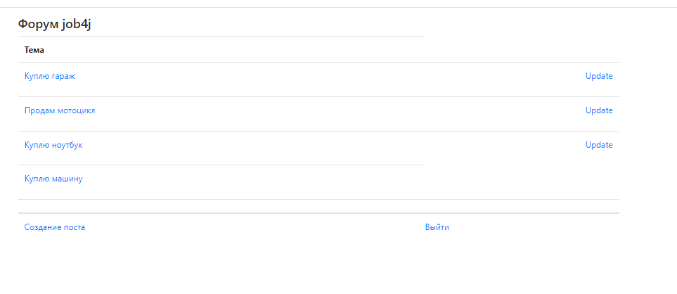
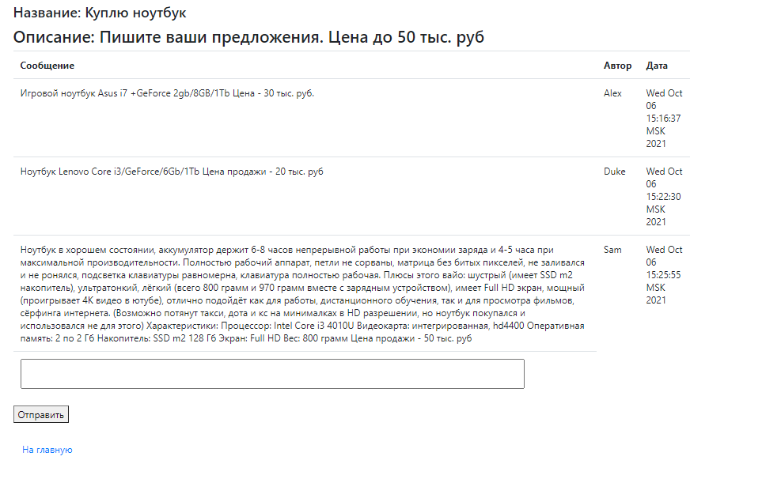
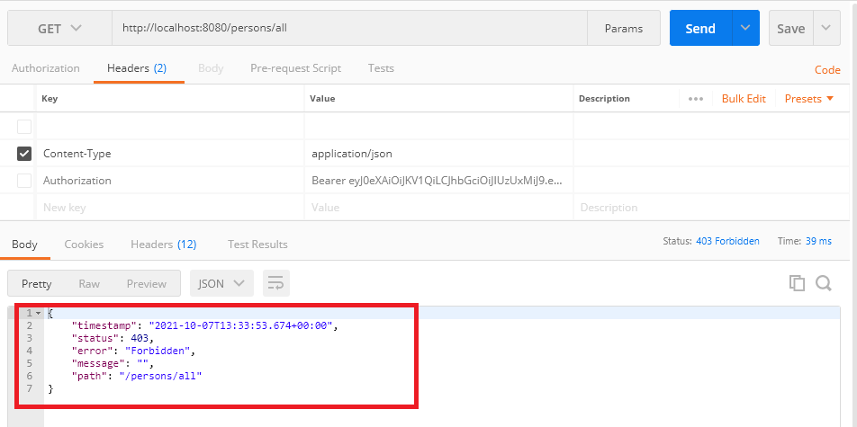
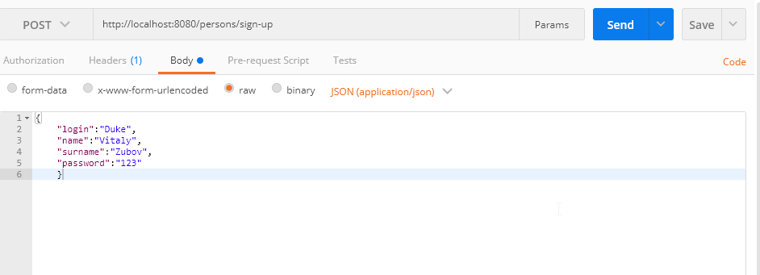
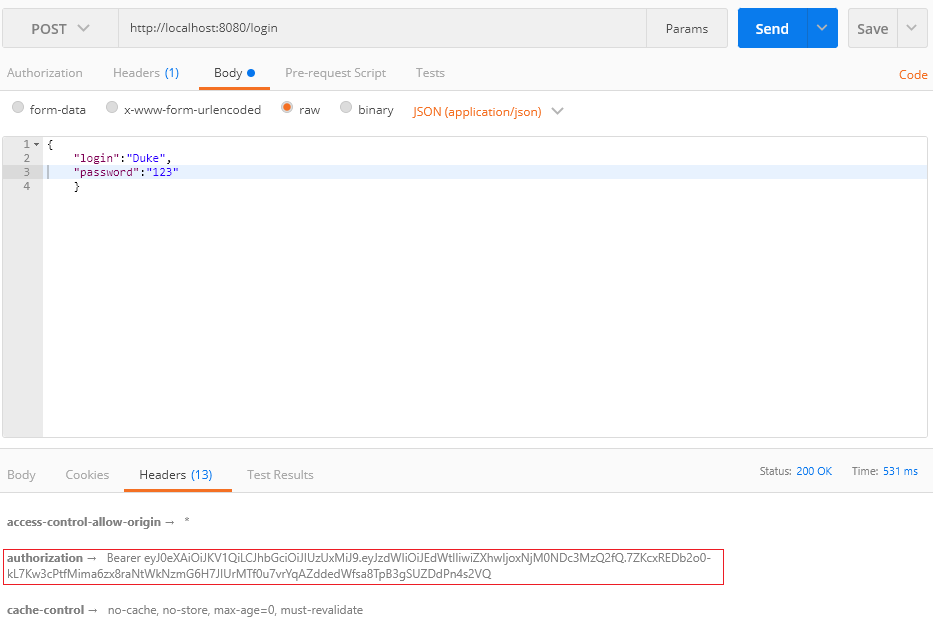
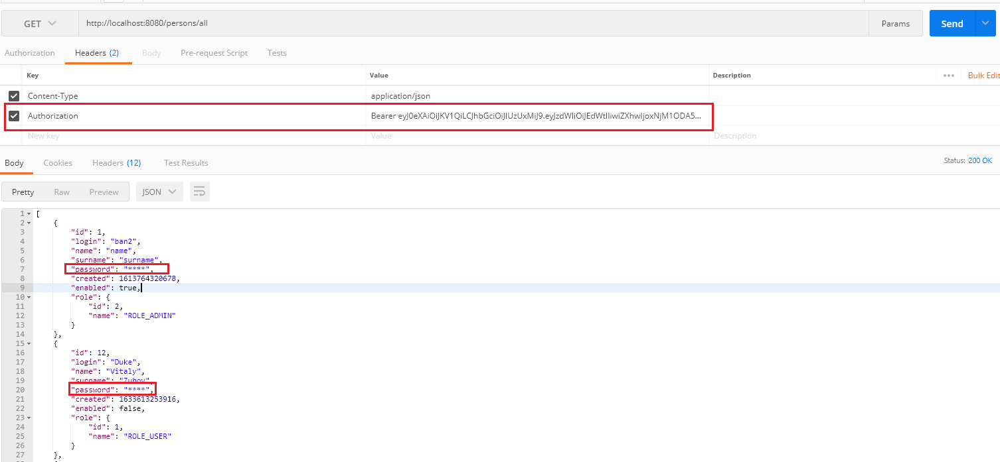
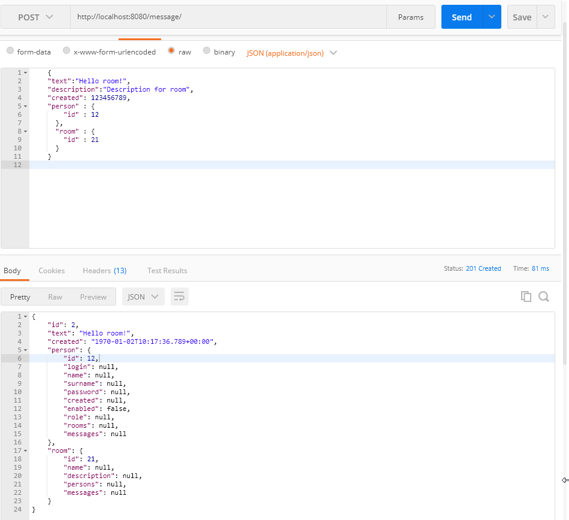

## Изучения Spring Boot и RESTFull API
Основная задача - это изучить и научиться применять Spring Boot и RESTFull API, которые используются в разработке на языке Java.

### Spring Boot
#### Форум
В качестве изучения основных принципов для работы со Spring Boot было разработано классическое приложение - форум.  
Для того, чтобы попасть на страницу с постами, необходимо пройти регистрацию или авторизацию, в проекте настроена система фильтрации. После авторизации/регистрации пользователь попадает на главную страницу, на которой расположены публикации других пользователей.    
    
Любому пользователю разрешено создавать пост. Редактирование поста разрешено только создателю поста. Каждый пользователь под постом может оставить свой комментарии.     
     
Данный проект разрабатывался на основе следующих модулей Spring:    
1) Spring Core Container (Beans, Core, Context, SpEl);  
2) Spring Data (JDBC, ORM); 
3) Spring Web (Servlet, Web);   
4) Spring Test; 
5) Spring Security.  

Кроме Spring Boot в ходе разработки проекта использовались следующие инструменты:
   * java
   * servlets
   * postgresql
   * js
   * ajax
   * jquery
   * bootstrap
   * jstl
   * jsp
   * maven
   * liquibase
   * junit

### RESTFull API
#### Чат
В качестве изучения основных принципов для работы со Spring Boot с использованием RESTFull архитектуры было разработано классическое приложение - чат.
Для того, чтобы была возможность использовать данное приложение, необходимо пройти регистрацию или авторизацию. Без регистрации доступ к чату будет заблокирован.   
  
Регистрация пользователя происходит по Post запросу http://localhost:8080/sing-up.  
   
Авторизация в Rest приложения настроена через JWT token. Получение токена происходит по Post запросу http://localhost:8080/login.     
    
После добавления токена в header запроса, будет доступен полный функционал данного приложения. Можно запросить список всех зарегистрированных пользователей(пароль пользователей умышленно не предоставляется всем пользователям).    
   
Пользователю доступно создавать новые комнаты для общения, а также возможность доступно оставлять свои сообщения в уже существующих комнатах.   
   

